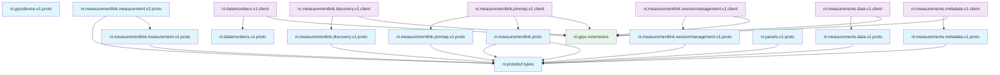

# Hello

```mermaid
graph TD
    %% Proto packages (base level)
    A[ni.datamonikers.v1.proto] 
    B[ni.grpcdevice.v1.proto]
    C[ni.measurementlink.discovery.v1.proto]
    D[ni.measurementlink.measurement.v1.proto]
    E[ni.measurementlink.measurement.v2.proto]
    F[ni.measurementlink.pinmap.v1.proto]
    G[ni.measurementlink.proto]
    H[ni.measurementlink.sessionmanagement.v1.proto]
    I[ni.measurements.data.v1.proto]
    J[ni.measurements.metadata.v1.proto]
    K[ni.panels.v1.proto]
    L[ni.protobuf.types]
    
    %% Extension packages
    M[ni-grpc-extensions]
    
    %% Client packages (depend on proto packages)
    N[ni.datamonikers.v1.client]
    O[ni.measurementlink.discovery.v1.client]
    P[ni.measurementlink.pinmap.v1.client]
    Q[ni.measurementlink.sessionmanagement.v1.client]
    R[ni.measurements.data.v1.client]
    S[ni.measurements.metadata.v1.client]
    
    %% Dependencies
    N --> A
    N --> M
    
    O --> C
    O --> M
    
    P --> F
    P --> G
    P --> M
    
    Q --> H
    Q --> M
    
    R --> I
    R --> M
    
    S --> J
    S --> M
    
    %% Proto package dependencies (common patterns)
    C --> L
    D --> L
    E --> L
    F --> L
    G --> L
    H --> L
    I --> L
    J --> L
    K --> L
    
    %% Measurement v2 depends on v1
    E --> D
    
    %% MeasurementLink proto depends on base proto types
    G --> L
    
    %% Style classes
    classDef protoPackage fill:#e1f5fe
    classDef clientPackage fill:#f3e5f5
    classDef extensionPackage fill:#e8f5e8
    
    class A,B,C,D,E,F,G,H,I,J,K,L protoPackage
    class N,O,P,Q,R,S clientPackage
    class M extensionPackage
```