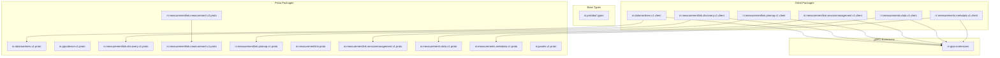

```mermaid
graph TB
    subgraph "Base Types"
        PT[ni.protobuf.types]
    end
    
    subgraph "gRPC Extensions"
        GE[ni-grpc-extensions]
    end
    
    subgraph "Proto Packages"
        DP[ni.datamonikers.v1.proto]
        GDP[ni.grpcdevice.v1.proto]
        DISC[ni.measurementlink.discovery.v1.proto]
        MEAS1[ni.measurementlink.measurement.v1.proto]
        MEAS2[ni.measurementlink.measurement.v2.proto]
        PIN[ni.measurementlink.pinmap.v1.proto]
        ML[ni.measurementlink.proto]
        SESS[ni.measurementlink.sessionmanagement.v1.proto]
        DATA[ni.measurements.data.v1.proto]
        META[ni.measurements.metadata.v1.proto]
        PAN[ni.panels.v1.proto]
    end
    
    subgraph "Client Packages"
        DC[ni.datamonikers.v1.client]
        DISCC[ni.measurementlink.discovery.v1.client]
        PINC[ni.measurementlink.pinmap.v1.client]
        SESSC[ni.measurementlink.sessionmanagement.v1.client]
        DATAC[ni.measurements.data.v1.client]
        METAC[ni.measurements.metadata.v1.client]
    end
    
    %% Simple vertical dependencies
    DC --> DP
    DC --> GE
    DISCC --> DISC
    DISCC --> GE
    PINC --> PIN
    PINC --> GE
    SESSC --> SESS
    SESSC --> GE
    DATAC --> DATA
    DATAC --> GE
    METAC --> META
    METAC --> GE
    
    MEAS2 --> MEAS1
```